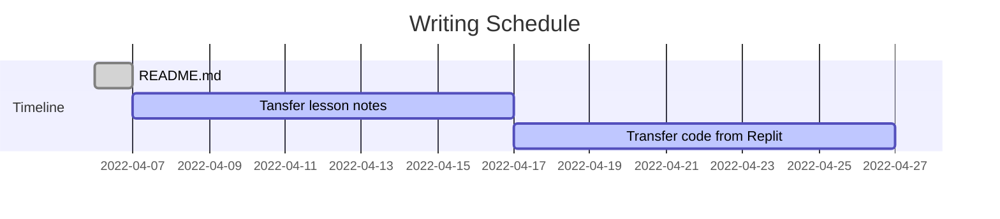

# My Journey with Python

 

Throughout my career and education in information technology, I had taken three beginner python courses. I took those classes because it was the hype language at the moment, and I thought I had a decent understanding. It wasn't until I took the fourth python course as part of my degree program to humble my ego. It has a 4-hour block test for solving 21 coding challenges. The experience taught me learning and understanding code is one skill but developing solutions and applying the best practice methodology for the code is a whole different skill. This page is dedicated to my never-ending journey with python.

## Status




## Tips for real-world application

1. When writing code follow the best practices outlined in [PEP20 - Zen of Python](https://peps.python.org/pep-0020/)

2. Check any incoming input strings and prep to remove empty spaces with `strip()` remember we're humans and sometime people added an extra space at the end by accident. 

3.  Use `join` to save time for concatenating (combining) a list of str values. No need to use the loop method and combine the str together.
  
      ```python
      #Example
      color_list = ['red','blue']
      print('$'.join(color_list))
      ```   


4. Using the `help()` function to print all properties of a given class or method.

      ```python
      #Example
      #Print help for the str method on the python console
      help(str)
      
      ```


5. To check builtin-in modules loaded use the dunder method and output the properities.

      Loop through `__builtins__.__dict__` and review modules for additional info.
      ```python
      #Example
      for x in __builtins__.__dict__:
            print(x)
      ```
      or with comprehension
      ```python
      #Example
      [print(x) for x in __builtins__.__dict__]
      ```
6. Pratice using python comprhension to simplify code.  

7. `assert` is useful for evaluting code. 

8. Having a good understandning of the fundamental methods, class, functions will significanlty increase your ability to develop a solution.

```python
#Example
#Using open(), str(), list() methods to modify a given excel report.     

```


## Basic Knowledege
- When creating a variable, it must start as a **letter** or an **underscore**
- Python treats characters differently depending on the class, i.e. '1' is not 1
- When in doubt reference [Python documentation](https://docs.python.org/)

## Manipluating the string = str 
Any string / str can be modified, there are many str.methods at your disposal to transform the characters to your need.

### String Splicing
Essentially selecting a character by picking it's positional place in the word. Remember positional value starts from 0 and empty value (i.e. blank space) counts.
```python
#Example
word = 'Hello World!'
print(word[0])
print(word[1])
print(word[11])
```

### String Splicing II
You can also iterate over strings with a verbose method `[a:b:c]`
- a is the starting position
- b is the ending position
- c is the frequency

Note: 
- When using this method positional value start at 1.
- Default starting value is 0, and  frequency value is 1, `[0::1]`
- To print in reverse order use the frequency value at -1, `[::-1]`

```python
#Example
word = 'Hello World!'
print(word[1:5:])
print(word[::2])
print(word[::-1])

```

### String Alignment
You can align string depending on the position of a give text value with the `str:<value`
```python
#Example
my_string = '{string1:>1}'
my_string2 = '{string1:>10}'
print(my_string.format(string1='Hello'))
print(my_string2.format(string1='Hello'))
```


## Exceptions
Are used to handled data that does not mesh with your code. Example, you want a user to enter a data in string format, you can use the Exception class dervived from the BaseException to throw and error.


## Resources
- Meterics powered by [shields.io](https://shields.io/)
- Graph powered by [mermaid-ji.github.io](https://mermaid-js.github.io/mermaid/#/)

