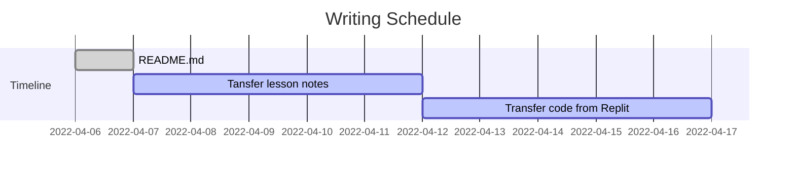

# My Journey with Python

Throughout my career and personal education in information technology, I have taken about three beginner python courses. I took those classes because it was the coolest language at the moment, and I thought I had a decent understanding. Boy, was I wrong.... when I went through the fourth python course as part of my degree program to my shock, it was one of the most challenging courses I've taken. Since I didn't remember any of the material from the previous classes,  I had to start all over again. It truly shined a light on the importance of applying the skills you learn and keep practicing your trade. This page is dedicated to my never-ending journey with python.

## Status

## Tips for real-world application

1. Remember when writing code to follow the best practices outlined in [PEP20 - Zen of Python](https://peps.python.org/pep-0020/)

2. Check any incoming input strings and prep to remove empty spaces with `strip()` remember we're human and sometime folks added an extra space at the end by accident. 

3. Use `join` to save time for concanting (combining) a list of str values. No need to loop and concat the str togther.

      Example:

      `colour_list = ['red','blue']`
  
      `print('$'.join(color_list))`
  
      `>red$blue` 

4. Using the `help()` function to print all properties of a given class.

      Try typing `help(str)`

5. To see check builtin-in modules loaded check.

      Loop through `__builtins__.__dict__` and review modules for additional info/

      Example:

            `for x in __builtins__.__dict__:`
 
            `print(x)` # remeber to indent this line

      or with comprehension

      `[print(x) for x in __builtins__.__dict__]`

6. Try to pratice using python comprhension to simplify code.  

7. `assert` is useful for evaluting code. 

## Basic Knowledege
When creating a variable, it must start as a **letter** or an **underscore**
Python treats characters differently depending on the class, i.e. '1' is not 1

## Exceptions
Are used to handled data that does not mesh with your code. Example, you want a user to enter a data in string format, you can use the Exception method to throw and error.

